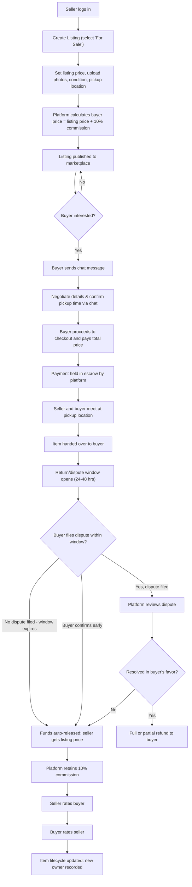
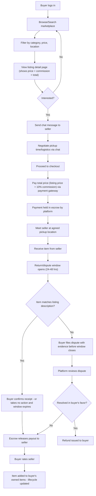
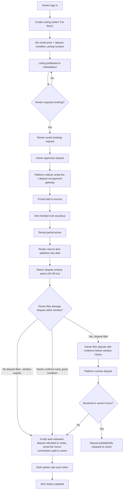
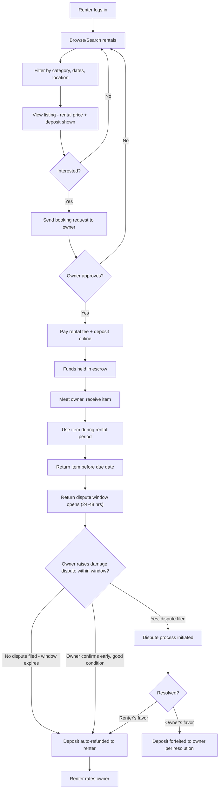

# AIT Circular Marketplace

Buy, Sell & Rent for the AIT Student Community

A closed, calendar-aware, trust-mediated marketplace exclusive to AIT students, enabling students to buy, sell, and rent everyday items — with platform-mediated escrow and commission on every transaction.

**Course:** AST02.21 — E-Business Development and Technology
**Team:** Samichi Rungta · Chidsanuphong Pengchai (Admin) · Lucja Wojtowicz

---

## Tech Stack

- **Frontend/Framework:** Next.js (App Router)
- **Database & Auth:** Supabase (Postgres, Auth, Storage, Realtime)
- **Deployment:** Vercel
- **Payments:** Omise / 2C2P (Thailand-compatible payment gateway)

---

## Table of Contents

1. [Page Mapping](#page-mapping)
2. [Features](#features)
3. [User Flow Diagrams](#user-flow-diagrams)
   - [Seller Perspective — Selling an Item](#seller-perspective--selling-an-item)
   - [Buyer Perspective — Buying an Item](#buyer-perspective--buying-an-item)
   - [Owner Perspective — Renting Out an Item](#owner-perspective--renting-out-an-item)
   - [Renter Perspective — Renting an Item](#renter-perspective--renting-an-item)

---

## Page Mapping

### Public / Marketing
| Route | Purpose |
|---|---|
| `/` | Landing page — value prop, how it works, CTA to sign up |
| `/how-it-works` | Explains buy/sell/rent + calendar-matching + escrow |

### Auth
| Route | Purpose |
|---|---|
| `/login` | Login (Supabase Auth) |
| `/signup` | Signup — restricted to `@ait.asia` domain |
| `/verify-email` | Magic link / OTP confirmation screen |
| `/onboarding` | First-time setup: dorm/pickup location, notification prefs |

### Browse & Discovery
| Route | Purpose |
|---|---|
| `/marketplace` | Main listings grid — filters: category, sale/rent, price, location |
| `/marketplace/[category]` | Category-filtered view (furniture, electronics, etc.) |
| `/listing/[id]` | Listing detail — photos, price, condition, seller info, item history, chat CTA |
| `/search?q=` | Search results |

### Selling / Listing Management
| Route | Purpose |
|---|---|
| `/sell/new` | Create listing (multi-step: Sale/Rent → category → photos → price/deposit → condition → pickup location) |
| `/dashboard/listings` | My listings (active / sold / rented / draft) |
| `/dashboard/listings/[id]/edit` | Edit a listing |
| `/dashboard/listings/[id]/requests` | Incoming buy/rent requests for a listing |

### Pre-Arrival Matching
| Route | Purpose |
|---|---|
| `/needs/new` | Register a pre-arrival need |
| `/dashboard/needs` | My registered needs + auto-matches |
| `/matches` | Calendar-aware suggested matches |

### Transactions
| Route | Purpose |
|---|---|
| `/listing/[id]/checkout` | Checkout for both sales and rentals — total = listing price + 10% commission (+ deposit for rentals) |
| `/transaction/[id]` | Transaction status page (escrow held, dispute window countdown, pickup/return instructions) |
| `/transaction/[id]/confirm` | Buyer/renter confirms receipt or return condition |
| `/dispute/[id]` | Dispute filing/tracking flow |
| `/dashboard/orders` | My purchases & sales history |
| `/dashboard/rentals` | My rentals — as renter and as owner |

### Messaging
| Route | Purpose |
|---|---|
| `/messages` | Inbox |
| `/messages/[conversationId]` | Chat thread tied to a specific listing |

### Profile & Account
| Route | Purpose |
|---|---|
| `/profile/[userId]` | Public profile — ratings, item history, verification badge |
| `/dashboard/profile` | Edit own profile |
| `/dashboard/settings` | Notification prefs, linked AIT email, payment methods |
| `/dashboard/wallet` | Escrow balance, transaction history, payouts |
| `/dashboard/reviews` | Reviews given/received |

### Notifications
| Route | Purpose |
|---|---|
| `/notifications` | Match alerts, chat pings, dispute-window reminders, seasonal surge alerts |

### Admin (internal, moderation/dispute team)
| Route | Purpose |
|---|---|
| `/admin/dashboard` | Overview stats |
| `/admin/disputes` | Dispute resolution queue |
| `/admin/users` | User verification/moderation |
| `/admin/listings` | Listing moderation queue |

---

## Features

**Authentication & Verification**
- AIT email-restricted signup (Supabase Auth, domain-gated magic link/OTP)
- Verification badge on profile

**Listings**
- Create/edit/delete listing (Sale or Rent)
- Multi-photo upload (Supabase Storage)
- Condition, price/deposit, category, pickup location fields
- Draft/active/sold/rented status states

**Search & Discovery**
- Category browsing, keyword search
- Filters: price range, sale vs. rent, pickup location, availability window
- Sort by newest, price, distance

**Pre-Arrival Matching**
- Pre-arrival need registration (item + needed-by date)
- Calendar-aware auto-matching (outgoing listings ↔ incoming needs)
- Seasonal surge highlighting (auto-promote move-out/new-arrival listings near semester dates)

**Transactions & Payments**
- All transactions (sales **and** rentals) route through the platform payment gateway — no in-person cash exchange
- 10% platform commission on every transaction: buyer/renter pays listing price + commission; seller/owner receives the listing price
- Escrow holding for all payments until handover/return is confirmed
- Optional premium placement fee for frequent listers

**Escrow & Auto-Release**
- Funds held in escrow from checkout until a dispute window closes
- 24–48 hour dispute window opens at handover (sales) or return (rentals)
- Auto-release to seller/owner if no dispute is filed within the window (via scheduled Supabase function)
- Manual early confirmation also releases funds immediately

**Rental-Specific**
- Booking request → owner approval flow
- Deposit hold and scheduled release alongside rental fee
- Return confirmation flow (photo-based condition check)

**Trust & Safety**
- Rating system (buyer/seller/renter, post-transaction)
- Item lifecycle/ownership history view
- Dispute filing and resolution workflow with admin review

**Communication**
- In-platform real-time chat (Supabase Realtime), scoped per listing
- Push/email notifications for messages, matches, dispute-window deadlines

**Admin/Moderation**
- Listing moderation queue
- Dispute resolution dashboard
- User verification management

---

## User Flow Diagrams

All four flows share the same escrow pattern: **payment held → dispute window opens at handover/return → auto-release if silent, dispute path if raised.** This is a single reusable mechanism (a scheduled Supabase function checking window expiry) applied consistently across sale and rental transaction types.

### Seller Perspective — Selling an Item

### Buyer Perspective — Buying an Item

### Owner Perspective — Renting Out an Item

### Renter Perspective — Renting an Item

---

## Revenue Model

- **10% platform commission on every transaction** — both sales and rentals. Buyer/renter pays listing price + commission; seller/owner receives the listing price.
- **Escrow/deposit handling** — built into the commission-bearing transaction flow for rentals (deposit held and released alongside the rental fee).
- **Optional premium placement** — frequent listers can pay a small fee for better visibility in search/matching results.
