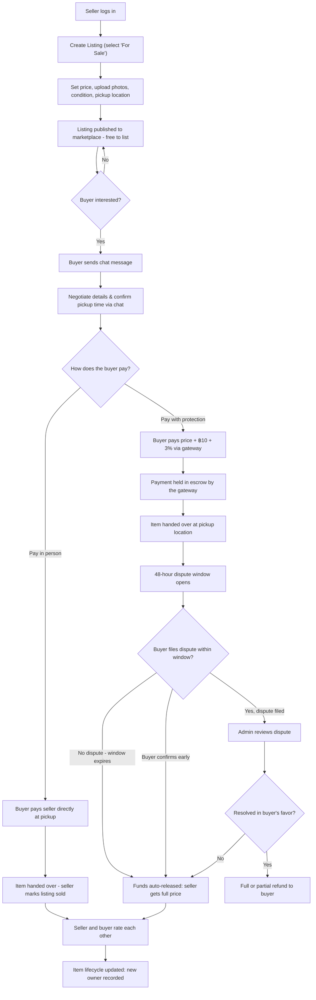
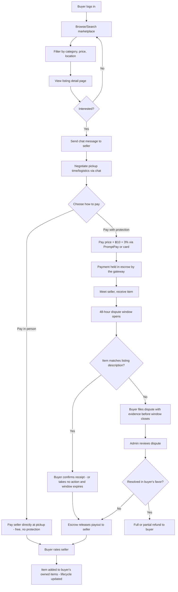
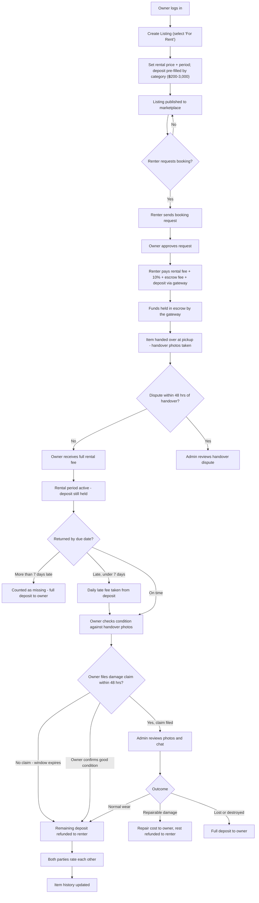
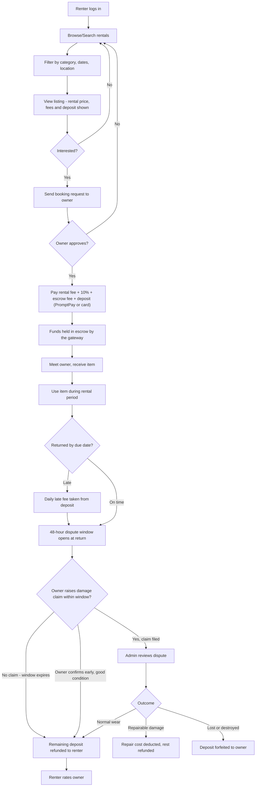

# Pass It On (AIT Circular Marketplace)

Buy, Sell & Rent for the AIT Student Community

A closed, calendar-aware, trust-mediated marketplace exclusive to AIT students, enabling students to buy, sell, and rent everyday items. Listing is free; the platform earns where it provides trust: deposit escrow on rentals, optional buyer protection on sales, and premium placement.

**Course:** AST02.21 — E-Business Development and Technology
**Team:** Samichi Rungta · Chidsanuphong Pengchai (Admin) · Lucja Wojtowicz

> **Money rules live in [BusinessRules.md](BusinessRules.md).** Fees, deposits, escrow, payouts and disputes in this file summarise that one; if they ever disagree, BusinessRules.md wins. The routes below are the planned full app; the routes that exist today are listed in [UserFlows.md](UserFlows.md).

---

## Tech Stack

- **Frontend/Framework:** Next.js (App Router)
- **Database & Auth:** Supabase (Postgres, Auth, Storage, Realtime)
- **Deployment:** Vercel
- **Payments:** simulated in the course build, with no payment gateway integration. A real launch would use Omise (PromptPay QR + cards); the "gateway" steps in the flows below are simulated state changes until then.

---

## Table of Contents

1. [Page Mapping](#page-mapping)
2. [Features](#features)
3. [User Flow Diagrams](#user-flow-diagrams)
   - [Seller Perspective — Selling an Item](#seller-perspective--selling-an-item)
   - [Buyer Perspective — Buying an Item](#buyer-perspective--buying-an-item)
   - [Owner Perspective — Renting Out an Item](#owner-perspective--renting-out-an-item)
   - [Renter Perspective — Renting an Item](#renter-perspective--renting-an-item)
4. [Revenue Model](#revenue-model)

---

## Page Mapping

### Public / Marketing
| Route | Purpose |
|---|---|
| `/` | Landing page — value prop, how it works, CTA to sign up |
| `/how-it-works` | Explains buy/sell/rent + calendar-matching + escrow |

### Auth
| Route | Purpose |
|---|---|
| `/login` | Login (Supabase Auth) |
| `/signup` | Signup — restricted to `@ait.asia` domain |
| `/verify-email` | Magic link / OTP confirmation screen |
| `/onboarding` | First-time setup: dorm/pickup location, notification prefs |

### Browse & Discovery
| Route | Purpose |
|---|---|
| `/marketplace` | Main listings grid — filters: category, sale/rent, price, location |
| `/marketplace/[category]` | Category-filtered view (furniture, electronics, etc.) |
| `/listing/[id]` | Listing detail — photos, price, condition, seller info, item history, chat CTA |
| `/search?q=` | Search results |

### Selling / Listing Management
| Route | Purpose |
|---|---|
| `/sell/new` | Create listing (multi-step: Sale/Rent → category → photos → price → deposit for rentals, pre-filled with the category's suggested amount and limited to ฿200–3,000 → condition → pickup location → optional premium placement) |
| `/dashboard/listings` | My listings (active / sold / rented / draft) |
| `/dashboard/listings/[id]/edit` | Edit a listing |
| `/dashboard/listings/[id]/requests` | Incoming buy/rent requests for a listing |

### Pre-Arrival Matching
| Route | Purpose |
|---|---|
| `/needs/new` | Register a pre-arrival need |
| `/dashboard/needs` | My registered needs + auto-matches |
| `/matches` | Calendar-aware suggested matches |

### Transactions
| Route | Purpose |
|---|---|
| `/listing/[id]/checkout` | **Rental:** total = rental fee + 10% commission + escrow fee + deposit. **Sale:** buyer chooses *Pay in person* (free, no escrow) or *Pay with protection* (price + ฿10 + 3%, held in escrow) |
| `/transaction/[id]` | Transaction status page (escrow held, dispute window countdown, pickup/return instructions) |
| `/transaction/[id]/confirm` | Buyer/renter confirms receipt; owner confirms return condition with photos |
| `/dispute/[id]` | Dispute filing/tracking flow |
| `/dashboard/orders` | My purchases & sales history |
| `/dashboard/rentals` | My rentals — as renter and as owner |

### Messaging
| Route | Purpose |
|---|---|
| `/messages` | Inbox |
| `/messages/[conversationId]` | Chat thread tied to a specific listing |

### Profile & Account
| Route | Purpose |
|---|---|
| `/profile/[userId]` | Public profile — ratings, item history, verification badge |
| `/dashboard/profile` | Edit own profile |
| `/dashboard/settings` | Notification prefs, linked AIT email, payment methods |
| `/dashboard/wallet` | Escrow balance, refunded deposits, transaction history, payouts |
| `/dashboard/reviews` | Reviews given/received |

### Notifications
| Route | Purpose |
|---|---|
| `/notifications` | Match alerts, chat pings, dispute-window reminders, return-due and late reminders, seasonal surge alerts |

### Admin (internal, moderation/dispute team)
| Route | Purpose |
|---|---|
| `/admin/dashboard` | Overview stats |
| `/admin/disputes` | Dispute resolution queue (decides deposit splits and refunds) |
| `/admin/users` | User verification/moderation |
| `/admin/listings` | Listing moderation queue, including rental approval for items worth over ~฿6,000 |

---

## Features

**Authentication & Verification**
- AIT email-restricted signup (Supabase Auth, domain-gated magic link/OTP)
- Verification badge on profile
- Campus shops join as partner sellers (`UserKind = 'shop'`) under the same rules

**Listings**
- Create/edit/delete listing (Sale or Rent), always free to list
- Multi-photo upload (Supabase Storage)
- Condition, price, category, pickup location fields
- Rentals: deposit suggested by category, adjustable by the owner within ฿200–3,000 (30–50% of replacement value); a rental can't be published without a deposit
- Draft/active/sold/rented status states

**Search & Discovery**
- Category browsing, keyword search
- Filters: price range, sale vs. rent, pickup location, availability window
- Sort by newest, price, distance

**Pre-Arrival Matching**
- Pre-arrival need registration (item + needed-by date)
- Calendar-aware auto-matching (outgoing listings ↔ incoming needs)
- Seasonal surge highlighting (auto-promote move-out/new-arrival listings near semester dates)

**Transactions & Payments**
- **Rentals always go through the platform.** Renter pays rental fee + 10% commission + escrow fee (`max(฿30, 3% of deposit)`) + refundable deposit.
- **Sales: the buyer chooses.** *Pay in person*: free, paid directly to the seller, no escrow or dispute support. *Pay with protection*: price + ฿10 + 3%, held in escrow.
- The seller/owner always receives their full listing price; platform fees are paid by the buyer/renter on top.
- Payment methods: PromptPay QR (default, cheapest) and cards (for incoming international students without a Thai bank account)
- Gateway fees are absorbed by the platform; deposits are always refunded in full
- Optional premium placement: ฿49 for 7 days

**Escrow & Auto-Release**
- Funds are held by the licensed payment gateway, never by the owner or the team's own bank account
- 48-hour dispute window opens at handover (protected sales) or at return (rentals)
- Rental fee is paid out to the owner 48 hours after handover if no dispute is filed; the deposit stays held until return
- Auto-release when the window closes with no dispute (via scheduled Supabase function)
- Manual early confirmation also releases funds immediately

**Rental-Specific**
- Rental periods: per week, per month, per semester
- Booking request → owner approval → payment → handover
- Return confirmation flow (owner compares photos from handover and return)
- Late return: daily late fee taken from the deposit; more than 7 days late counts as missing and the full deposit goes to the owner

**Trust & Safety**
- Rating system (buyer/seller/renter, post-transaction)
- Item lifecycle/ownership history view
- Dispute filing and resolution workflow with admin review
- Owner can never receive more than the deposit

**Communication**
- In-platform real-time chat (Supabase Realtime), scoped per listing
- Push/email notifications for messages, matches, dispute-window deadlines, return-due dates

**Admin/Moderation**
- Listing moderation queue
- Dispute resolution dashboard
- User verification management

---

## User Flow Diagrams

Rentals and protected sales share one escrow pattern: **payment held → 48-hour dispute window opens at handover/return → auto-release if silent, dispute path if raised.** It is a single reusable mechanism (a scheduled Supabase function checking window expiry). Sales paid in person skip it entirely.

### Seller Perspective — Selling an Item

### Buyer Perspective — Buying an Item

### Owner Perspective — Renting Out an Item

### Renter Perspective — Renting an Item

---

## Revenue Model

Full formulas and amounts are in [BusinessRules.md](BusinessRules.md#2-fees).

- **Free to list** — every sale and rental listing is free, keeping the "Facebook group replacement" use case frictionless.
- **Rental commission** — 10% of the rental fee, paid by the renter at booking. Primary revenue stream.
- **Escrow handling fee** — `max(฿30, 3% of deposit)` per rental, paid by the renter, for holding the deposit and running disputes. It scales so gateway fees on large deposits are covered.
- **Buyer protection fee** — ฿10 + 3% on sales where the buyer chooses *Pay with protection*. Sales paid in person stay free.
- **Premium placement** — ฿49 for 7 days at the top of search and matching, for frequent listers.
